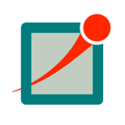

# Hello, I’m Rafael Cotrim!

- 🇧🇷 Brazilian
- Software developer and researcher
- I live in [Castlo Branco, Portugal 🇵🇹](https://www.google.com/maps/place/Castelo+Branco/)
- Hobbies:
    - [Worldbuilding](https://en.wikipedia.org/wiki/Worldbuilding)
     - Reading
    - Making games
- Currently experimenting with [Rust](https://www.rust-lang.org/)
- 2022 Goals: 
    - [ ] Finish my worldbuilding  calculator/generator [project](https://github.com/RafaelCotrim/ge13)
    - [ ] Finish my next scientific article
    - [ ] Get an Azure certification

## Scientific Research

### Articles

[Power Saving MAC protocols in wireless sensor networks: a survey](http://doi.org/10.12928/telkomnika.v19i6.19148)

[Desenvolvimento, Simulação e Validação de Protocolos MAC para Redes de Sensores Sem Fios](https://doi.org/10.5335/rbca.v14i1.12679)

[Power Saving MAC Protocols in Wireless Sensor Networks: A Performance Assessment Analysis](https://www.astesj.com/v06/i04/p38/)

## Contact Information

- [<i class="devicon-linkedin-plain colored"></i> Linked In](https://www.linkedin.com/in/rafael-cotrim-208743214/)
- ✉️ rafael.souza.cotrim@gmail.com

## Languages and tools

[</img>](https://github.com/RafaelCotrim)
[</img>](https://en.wikipedia.org/wiki/C_Sharp_(programming_language))
[</img>](https://dotnet.microsoft.com/)
[</img>](https://www.java.com/en/)
[</img>](https://www.python.org/)
[</img>](https://www.arduino.cc/)
[</img>](https://en.wikipedia.org/wiki/C_(programming_language))
[</img>](https://en.wikipedia.org/wiki/C%2B%2B)
[</img>](https://omnetpp.org/)
[</img>](https://en.wikipedia.org/wiki/HTML)
[</img>](https://en.wikipedia.org/wiki/CSS)
[</img>](https://en.wikipedia.org/wiki/SQL)
[</img>](https://visualstudio.microsoft.com/)
[</img>](https://code.visualstudio.com/)
